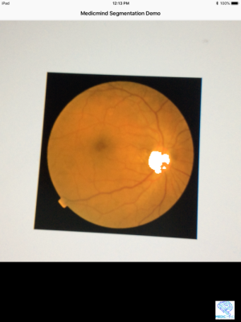

# segmentation_demo

IOS Demo for UNet segemention classifier generated by Medicmind

Demonstrates how to incorporate a trained segmentation model from Medicminds AI platform (https://www.medicmind.tech) into an iPhone App.
The neural network trained detects the optic disc in a retina

Medicmind converts a keras model into a ios metal model that can be incorporated into an app.
